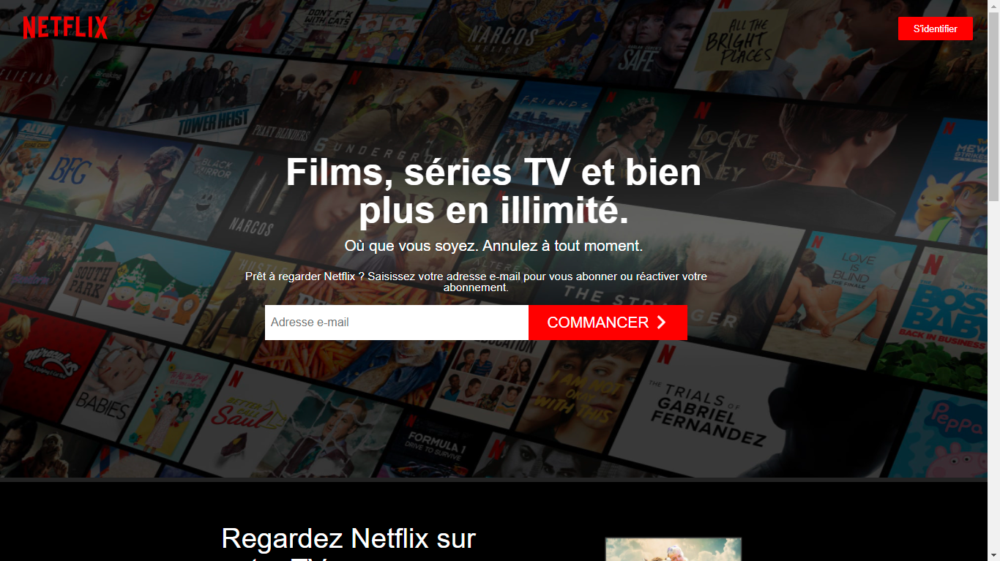

<h1 align="center">
    
</h1>

# :earth_africa: Netflix Clone Demo => https://netflix-frontend-three.vercel.app/
*clone created in (NodeJS, NextJS) as part of a Dev Full-Stack evaluation at Ynov Campus*  
  
- NodeJS  
- NextJS  
- Sass
- Graphql
- Stripe  

## How to clone/use the project
~~~bash
git clone https://github.com/A-Lamine/Netflix-frontend.git
git clone https://github.com/A-Lamine/Netflix-Backend.git
cd netflix-frontend
npm run dev

~~~
:warning: Don't forget to change .env value ! :warning:  
~~~bash
install :
npm i
~~~
  
### ID and Password (User)  
ID : user@user.fr  
Password : password  
#### You can create your own account
~~~bash
use test card number 4242 4242 4242 4242, a random three-digit CVC code
and an expiration date in the future
~~~

### ID and Password (Admin)  
ID : admin@admin.fr  
Password : password  
And Go to .../Admin
  
Enjoy :call_me_hand:
## To Do :  
- [X] 2 Subscription packs
- [ ] The user who unsubscribes will have the videos removed on the date of unsubscription
- [X] Movies belong to one or more categories
- [X] Provide a filter by categories on the film page
- [ ] Plan a persistent wishlist
- [ ] Provide email notifications
- [X] Provide a back office that allows you to add videos & categories
- [X] The user can find his subscription in his profile
## Bonus : 
- [X] Using graphql
- [X] Using a sass preprocessor
- [X] Responsive design (mobile)
